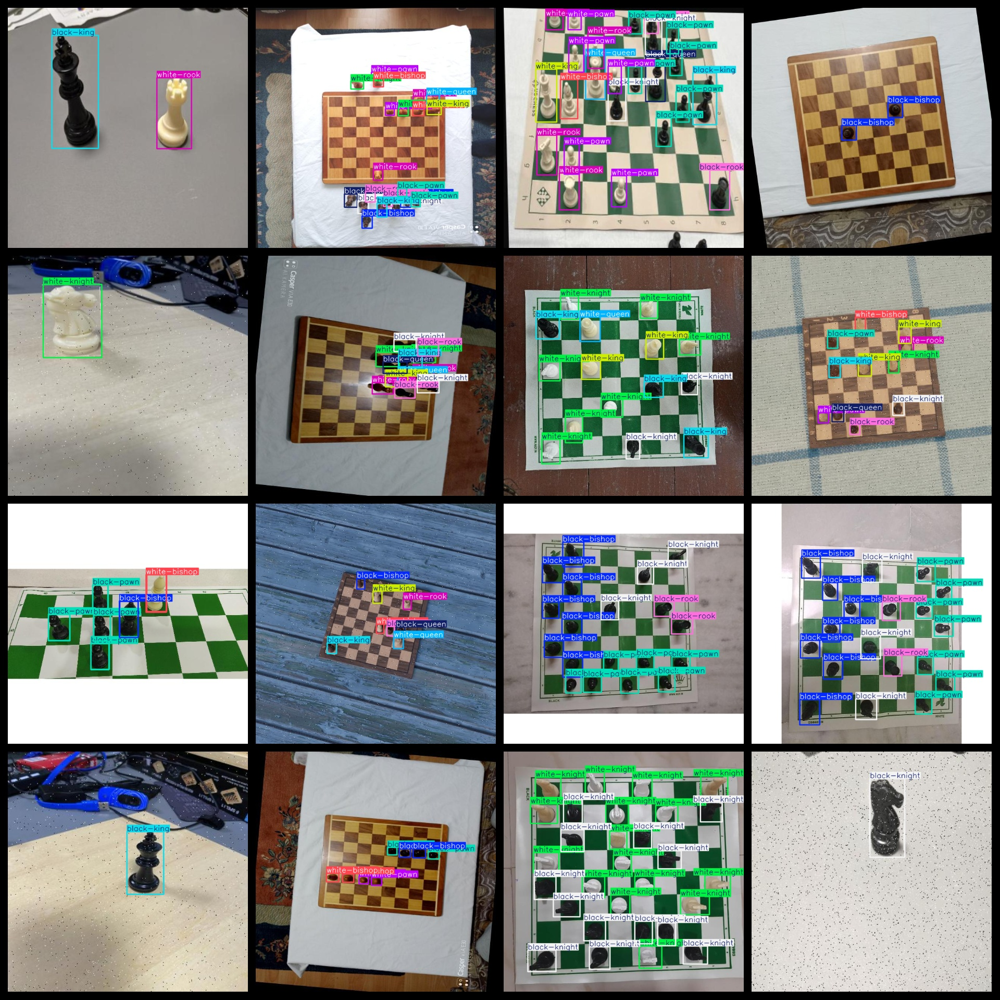
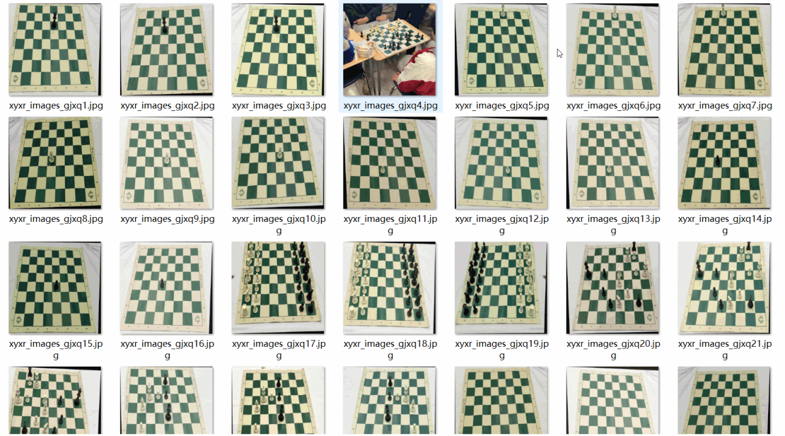

# [Object Detection] international Elephant Chess pieces Type Detection Dataset 6535 imagesYOLO+VOC format

【Object Detection】Chess Chesspiece Types Dataset with 6535 Images in YOLO+VOC format

Dataset Format: VOC format + YOLO format

The compressed file contains: three folders, each storing images, xml files, and text files.

Total jpg images in JPEGImages folder: 6535

The total number of XML files in the Annotations folder is 6535.

The total number of txt files in the labels folder is 6535.

Number of tag types: 12

Tag names: ["black-bishop","black-king","black-knight","black-pawn","black-queen","black-rook","white-bishop","white-king","white-knight","white-pawn","white-queen","white-rook"]

The number of boxes for each label (Note that the order of labels in the Yolo format does not correspond to this, but is based on the classes.txt file in the labels folder):

black-bishop frame count = 6667

black-king frame count = 4962

black-knight frame count = 5841

black-pawn frame count = 17059

black-queen frame count = 4298

black-rook frame count = 6427

white-bishop frame count = 6562

white-king frame count = 5349

white-knight frame count = 6352

white-pawn frame count = 12384

white-queen frame count = 5121

white-rook frame count = 5249

Total boxes: 86271

Picture clarity (Resolution: Pixels): Clear

Is the image enhanced: No

Shape of the label: Rectangular box, used for object detection and recognition.

Dataset Type ：119m

Special Notice: This dataset does not guarantee the accuracy or precision of the trained models or weight files. The dataset only provides accurate and reasonable annotations.

## Images

---

Here is a pay link on Stripe (https://buy.stripe.com/3cs8yP7sY87d0vu9AB). Please contact me lonlonago@foxmail.com after funding $89, and I will send you a complete data files, thank you!

